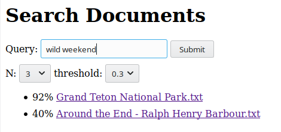

# QDOX

[](https://circleci.com/gh/stormcrows/qdox/tree/master)

CLI tool that uses NLP (machine learning for natural language processing) to process folders of documents and answer queries about them. It also offers a server that responds with JSON and provides convenient way of browsing documents.

---

## Installation

```bash
go get github.com/stormcrows/qdox
```

---

## Usage

```
COMMANDS:
     search   qdox search [folder] [query]
     serve    qdox serve [folder]
     help, h  Shows a list of commands or help for one command
```

---

## search folders

```
NAME:
   qdox search - qdox search [command options] [folder] [query]

OPTIONS:
   --pattern value, -P value    only parse files matching regular expression (default: "\\.txt$")
   -n value                     maximum number of results to return (default: 5)
   --threshold value, -t value  required minimum similarity per document (default: 0.3)
```
example:
```bash
qdox search ./books/ "knight of valour"
```
outputs:

```bash
82% "books/Around the End - Ralph Henry Barbour.txt"
```

---

## http serve query and documents

```
USAGE:
   qdox serve [command options] [arguments...]

OPTIONS:
   --port value, -p value                starts serving at given port (default: 8080)
   --pattern value, -P value             parse files matching given regexp pattern (default: "\\.txt$")
   --serve-documents, -s                 serves documents under /static path
   --watcher, -w                         updates model on observed folder's change
   --watcher-interval value, --wi value  folder update check interval in ms (default: 1000)
   --interact, -i                        simple query ui served at /index level
```

example:

```bash
qdox serve ./books/ -s
```

now make a call to `http://localhost:8080/query?q=wild+weekend&n=3&threshold=0.3`

and receive JSON response:

```json
{
    "Query": "wild weekend",
    "Results": [{
        "Name": "Grand Teton National Park.txt",
        "Path": "static/Grand Teton National Park.txt",
        "Similarity": "92"
    }, {
        "Name": "Around the End - Ralph Henry Barbour.txt",
        "Path": "static/Around the End - Ralph Henry Barbour.txt",
        "Similarity": "40"
    }]
}
```
*note: `Path` will be `""` if `-s` option is not specified!*

* Documents are served from `static` folder and can be accessed followed via provided path,
* `-w` flag will enable a recursive watcher on the folder that will update the model anytime there is a change in the file structure,
* `-i` flag will enable a simple query ui to be found under index page of `http://localhost:8080/`:
* `-s` enables serving documents from under the `/static` route



---

## Dependencies

- github.com/urfave/cli
- gonum.org/v1/gonum/mat
- github.com/james-bowman/nlp
- github.com/stretchr/testify/assert

---
   
**Book examples are in public domain, downloaded from Project Gutenberg.**